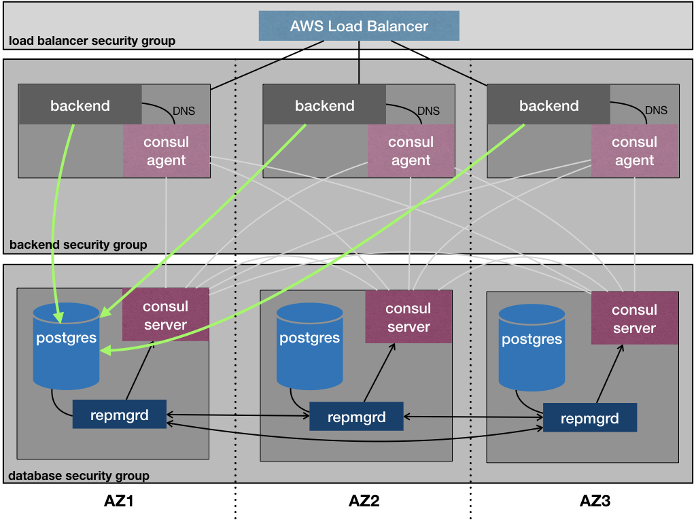

# Birthday service.

Allows to save bithday dates and tracks how many days left to the next birthday.

Birthday service system diagram:



Repository structure:

- ./backend - birthday service backend application code
- ./db - postgresql database schema code
- ./img - documentation images
- ./infra - ansible inventory files for deploying service to DEV and PROD environments
- ./playbooks - ansible playbooks and roles to provision and configure cloud infrastructure


## Run service locally using docker-compose.


Install:

```
docker-compose build
docker-compose up -d
```

The web service is available at http://localhost:3000/
The database is available at postgres://postgres@localhost:5432

Run db tests:

```
docker exec -ti birthday_service_db_1 psql -U postgres -f test/test.sql
```

Run backend tests:

```
docker exec -ti birthday_service_backend_1 npm test
```

## Deploy to development environment using Vagrant.

Prerequisites: vagrant, ansible

Create development environment:

```
mkdir ssh
ssh-keygen -f ssh/id_rsa -N ''
vagrant up
```

Install postgresql cluster:

```
ansible-playbook -i infra/dev/inventory.yaml playbooks/install_db.yaml
```

Install birthday service app

```
ansible-playbook -i infra/dev/inventory.yaml playbooks/install_backend.yaml
```

## Create production environment in AWS

To create a birthday service cluster in AWS first adjust the cluster topology in the file infra/prod/aws_env.yaml

Generate ssh key if you haven't done this before:

```
mkdir ssh
ssh-keygen -f ssh/id_rsa -N ''
```

Then run provisioning:

```
ansible-playbook -i infra/prod/aws_env.yaml playbooks/create_aws_env.yaml
```

After the infrastructure pieces are created adjust the private and floating IP addresses in the file /infra/prod/inventory.yaml accordingly.

Then run deployment:

```
ansible-playbook -i infra/prod/inventory.yaml playbooks/install_db.yaml
ansible-playbook -i infra/prod/inventory.yaml playbooks/install_backend.yaml
```

